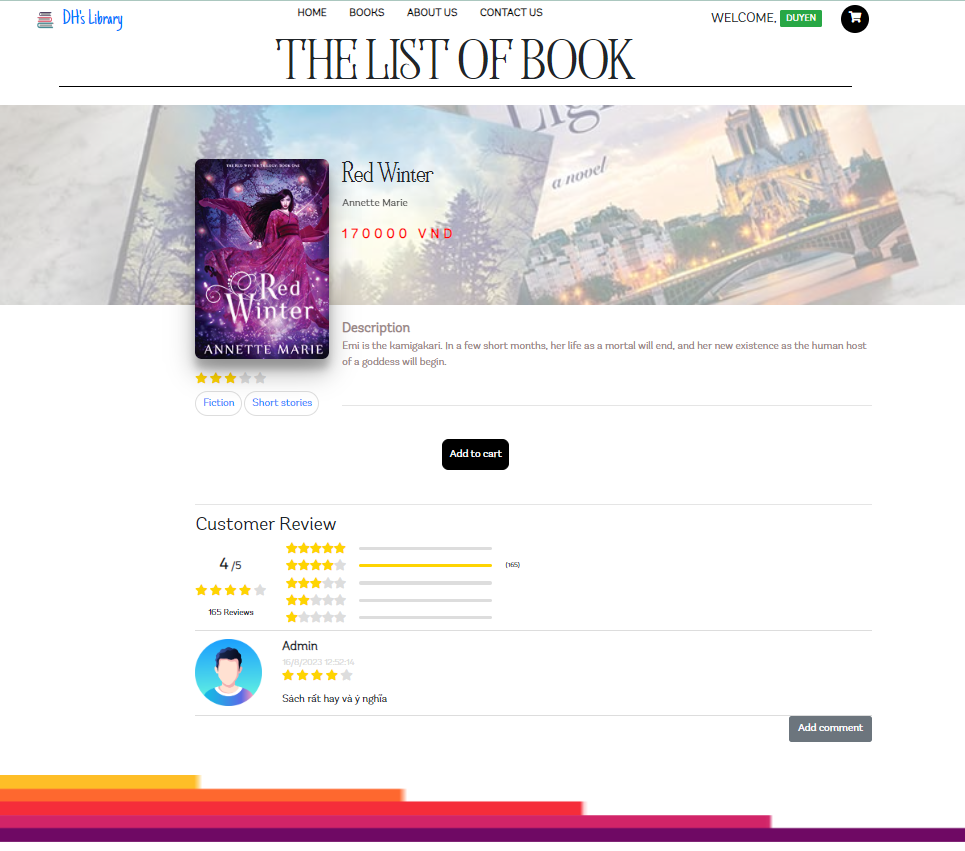
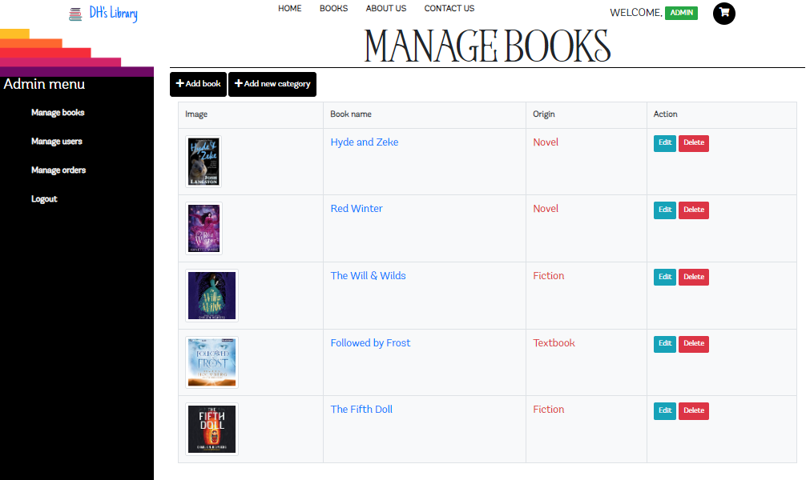
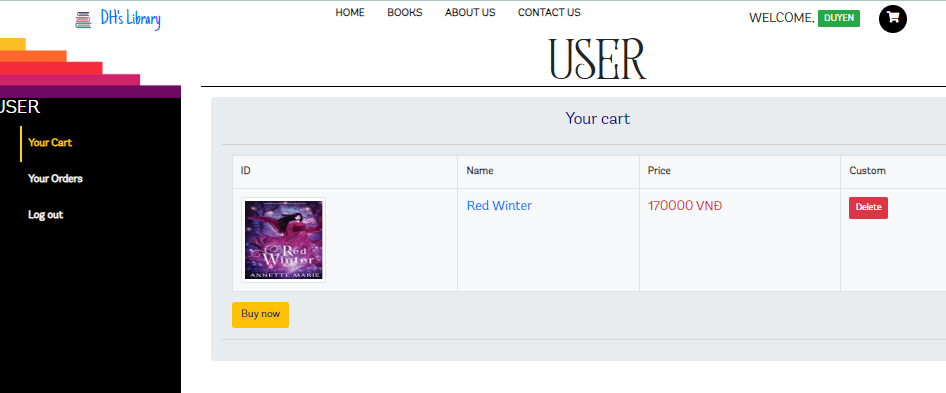
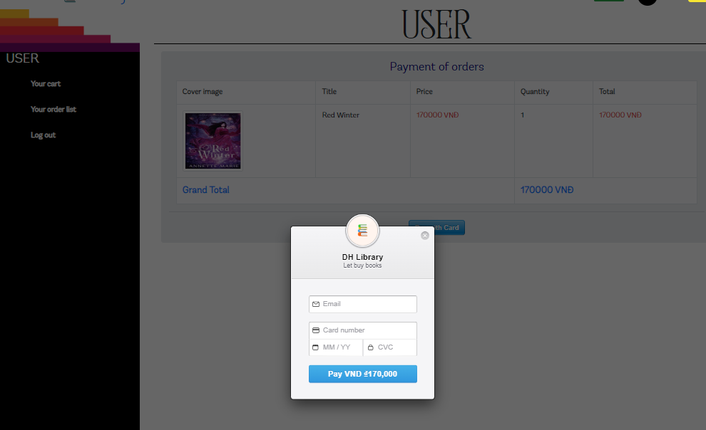

## BOOK STORE Website (Ecommerce Type)
---
* This Site is a mini Project using NodeJS. Which has a Customer Panel and a Admin Panel.

* Email Notification using `SEND GRID` api.

* Payment Method using `Stripe`
---
### Website Preview
* 
* 
* 
---
###  ADMIN PANEL
* Admin can see all of his Customer and Orders.
* Admin can only edit and delete a product.
---
* 
* 
* 
* 
---
### Customer Dashboard
* Customer can Comment on a Book.
* Customer can add a book to his Cart.
* Customer buy book in his cart. It also have a Quantity function. He can Buy More than one book of Same Type.
* Customer get a mail when his order is successful and when he registered on this Web
---
* 
* 
* 
---
# BookStore
- Test Stripe Card Details
- Card Number: 4242 4242 4242 4242
- Expiry: Any Future Month
- CVV: Any three Digit Number

